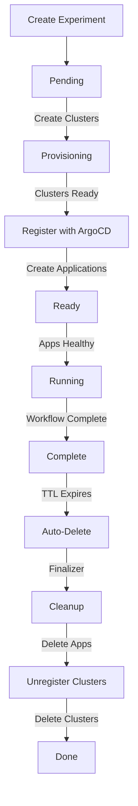

# Phase 3 Implementation Summary

**Status:** ✅ Complete
**Date:** 2026-02-05

## Overview

Successfully implemented Phase 3 of the Experiment Operator: **ArgoCD Integration**. The operator can now register clusters with ArgoCD, deploy applications, and monitor their health.

## Deliverables

### 1. ArgoCD Integration Package ✅

**Location:** `internal/argocd/`

**Files Created:**
- `client.go` - Main ArgoCD client wrapper
- `cluster.go` - Cluster registration/unregistration with ArgoCD
- `application.go` - Application management and health checks

**Key Features:**

#### Cluster Registration
```go
func RegisterCluster(ctx, c client.Client, clusterName, kubeconfig, server) error
```

- Creates ArgoCD cluster Secret in `argocd` namespace
- Secret format: `argocd.argoproj.io/secret-type: cluster`
- Includes kubeconfig and server endpoint
- Labels for experiment tracking

#### Application Management
```go
type ApplicationManager struct {
    client.Client
}

func (m *ApplicationManager) CreateApplication(ctx, experimentName, target, clusterServer) error
func (m *ApplicationManager) IsApplicationHealthy(ctx, experimentName, targetName) (bool, error)
func (m *ApplicationManager) GetApplicationComponents(ctx, experimentName, targetName) ([]string, error)
func (m *ApplicationManager) DeleteApplication(ctx, experimentName, targetName) error
```

**Application Features:**
- Multi-source support (multiple components per target)
- Automated sync with prune and self-heal
- Helm parameter injection from component.Params
- Health and sync status monitoring
- Component tracking (Deployment/Service/etc)

#### ArgoCD Application Spec
```yaml
apiVersion: argoproj.io/v1alpha1
kind: Application
metadata:
  name: gateway-tutorial-app
  namespace: argocd
  labels:
    experiments.illm.io/experiment: gateway-tutorial
    experiments.illm.io/target: app
spec:
  project: default
  sources:
    - repoURL: https://github.com/illMadeCoder/k8s-ai-cloud-testbed.git
      targetRevision: HEAD
      path: components/apps/envoy-gateway
    - repoURL: https://github.com/illMadeCoder/k8s-ai-cloud-testbed.git
      targetRevision: HEAD
      path: components/apps/nginx-ingress
  destination:
    server: https://34.71.112.81
    namespace: default
  syncPolicy:
    automated:
      prune: true
      selfHeal: true
    syncOptions:
      - CreateNamespace=true
```

### 2. Controller Updates ✅

**File:** `internal/controller/experiment_controller.go`

#### Added ArgoCD Client Field
```go
type ExperimentReconciler struct {
    client.Client
    Scheme         *runtime.Scheme
    ClusterManager *crossplane.ClusterManager
    ArgoCD         *argocd.Client  // NEW
}
```

#### Updated reconcileProvisioning() - Cluster Registration
```go
func (r *ExperimentReconciler) reconcileProvisioning(ctx, exp) (ctrl.Result, error) {
    // ... check cluster readiness ...

    // NEW: Register clusters with ArgoCD and create Applications
    for i, target := range exp.Spec.Targets {
        if exp.Status.Targets[i].Phase != "Ready" {
            continue
        }

        clusterName := exp.Status.Targets[i].ClusterName
        endpoint := exp.Status.Targets[i].Endpoint

        // Determine server URL
        server := endpoint
        if target.Cluster.Type == "hub" {
            server = "https://kubernetes.default.svc"
        } else if server == "" {
            server = "https://" + endpoint
        }

        // Get kubeconfig
        kubeconfig, _ := r.ClusterManager.GetClusterKubeconfig(ctx, clusterName, target.Cluster.Type)

        // Register and create apps
        r.ArgoCD.RegisterClusterAndCreateApps(ctx, exp.Name, target, clusterName, kubeconfig, server)
    }

    exp.Status.Phase = PhaseReady
    return ctrl.Result{Requeue: true}, nil
}
```

#### Updated reconcileReady() - App Health Checks
```go
func (r *ExperimentReconciler) reconcileReady(ctx, exp) (ctrl.Result, error) {
    // NEW: Check if all ArgoCD Applications are healthy
    allHealthy := true
    for i, target := range exp.Spec.Targets {
        if len(target.Components) == 0 {
            continue
        }

        healthy, _ := r.ArgoCD.AppManager.IsApplicationHealthy(ctx, exp.Name, target.Name)
        if !healthy {
            allHealthy = false
            continue
        }

        // Get deployed components
        components, _ := r.ArgoCD.AppManager.GetApplicationComponents(ctx, exp.Name, target.Name)
        exp.Status.Targets[i].Components = components
    }

    if !allHealthy {
        return ctrl.Result{RequeueAfter: 15 * time.Second}, nil
    }

    // All apps healthy, transition to Running
    exp.Status.Phase = PhaseRunning
    return ctrl.Result{Requeue: true}, nil
}
```

#### Updated handleDeletion() - Cleanup
```go
func (r *ExperimentReconciler) handleDeletion(ctx, exp) (ctrl.Result, error) {
    if controllerutil.ContainsFinalizer(exp, experimentFinalizer) {
        // NEW: Delete ArgoCD Applications
        for _, target := range exp.Spec.Targets {
            r.ArgoCD.AppManager.DeleteApplication(ctx, exp.Name, target.Name)
        }

        // NEW: Unregister clusters from ArgoCD
        clusterNames := collectClusterNames(exp)
        r.ArgoCD.DeleteClusterAndApps(ctx, exp.Name, exp.Spec.Targets, clusterNames)

        // Delete clusters (existing)
        for i, target := range exp.Spec.Targets {
            clusterName := exp.Status.Targets[i].ClusterName
            r.ClusterManager.DeleteCluster(ctx, clusterName, target.Cluster.Type)
        }

        controllerutil.RemoveFinalizer(exp, experimentFinalizer)
        return r.Update(ctx, exp)
    }
    return ctrl.Result{}, nil
}
```

### 3. Main Entry Point Update ✅

**File:** `cmd/main.go`

**Changes:**
- Import `internal/argocd` package
- Initialize ArgoCD client:

```go
if err := (&controller.ExperimentReconciler{
    Client:         mgr.GetClient(),
    Scheme:         mgr.GetScheme(),
    ClusterManager: crossplane.NewClusterManager(mgr.GetClient()),
    ArgoCD:         argocd.NewClient(mgr.GetClient()),  // NEW
}).SetupWithManager(mgr); err != nil {
    setupLog.Error(err, "unable to create controller", "controller", "Experiment")
    os.Exit(1)
}
```

## Complete Experiment Lifecycle

With Phases 1-3 complete, the operator now handles:



### Detailed Flow

1. **Pending → Provisioning:**
   - Create Crossplane cluster resources (GKE/Talos/vcluster)
   - Initialize target status

2. **Provisioning → Ready:**
   - Poll cluster readiness every 10s
   - Get cluster endpoint
   - **Register cluster with ArgoCD** (create Secret)
   - **Create ArgoCD Application** for each target
   - Transition when all clusters ready

3. **Ready → Running:**
   - **Poll Application health** every 15s
   - Check health status (Healthy) and sync status (Synced)
   - Get deployed components list
   - Transition when all apps healthy

4. **Running → Complete:**
   - TODO Phase 5: Submit Argo Workflow
   - TODO Phase 5: Watch workflow completion

5. **Complete → Auto-Delete:**
   - TTL check every hour (terminal states)
   - Delete experiment when TTL expires

6. **Deletion → Cleanup:**
   - **Delete ArgoCD Applications**
   - **Unregister clusters from ArgoCD**
   - Delete Crossplane cluster resources
   - Remove finalizer

## Testing

### Build Verification ✅

```bash
# Code compiles
$ go build -o /dev/null ./...
✓ Success

# Manifests generate
$ make manifests
✓ RBAC updated (already had argoproj.io permissions)
```

### What's Testable Now

1. **Full Cluster-to-App Flow:**
   ```yaml
   apiVersion: experiments.illm.io/v1alpha1
   kind: Experiment
   metadata:
     name: test-deployment
   spec:
     ttlDays: 1
     targets:
       - name: app
         cluster:
           type: gke
           zone: us-central1-a
           nodeCount: 2
         components:
           - app: nginx
             params:
               replicas: "3"
   ```

   **Expected behavior:**
   - GKE cluster created
   - Cluster registered with ArgoCD
   - ArgoCD Application created for nginx
   - Polls until app is Healthy
   - Transitions to Running

2. **Multi-Component Deployment:**
   ```yaml
   components:
     - app: envoy-gateway
     - app: nginx-ingress
     - app: demo-services
   ```

   **Expected behavior:**
   - Single Application with 3 sources
   - All components deployed to same cluster
   - Health check waits for all to be Healthy

3. **Hub Cluster (No Provisioning):**
   ```yaml
   cluster:
     type: hub
   components:
     - app: test-app
   ```

   **Expected behavior:**
   - No cluster creation
   - Registers hub as `https://kubernetes.default.svc`
   - Deploys app to hub cluster

## Architecture Decisions

### 1. Unstructured Client for ArgoCD ✅

**Rationale:** ArgoCD CRDs are external. Using `unstructured.Unstructured` avoids hard dependency on ArgoCD Go types.

**Benefits:**
- No vendoring ArgoCD modules
- Works with any ArgoCD version
- Simpler dependency management

### 2. Single Application Per Target ✅

**Rationale:** Each target gets one Application with multiple sources, rather than one Application per component.

**Benefits:**
- Simpler health checking (one status to watch)
- Atomic sync (all components sync together)
- Matches ArgoCD best practices

**Trade-off:** Can't deploy components to different namespaces within same target.

### 3. Automated Sync with Prune ✅

**Rationale:** Experiments are ephemeral - auto-healing and pruning prevent drift.

**Configuration:**
```yaml
syncPolicy:
  automated:
    prune: true      # Remove resources not in Git
    selfHeal: true   # Revert manual changes
```

**Benefits:**
- Ensures deployed state matches Git
- No manual intervention needed
- Prevents leftover resources

### 4. Server URL Logic ✅

**Implementation:**
```go
server := endpoint
if target.Cluster.Type == "hub" {
    server = "https://kubernetes.default.svc"  // In-cluster
} else if server == "" {
    server = "https://" + endpoint
}
```

**Handles:**
- Hub cluster (in-cluster reference)
- GKE cluster (external IP)
- Missing endpoint (defaults to HTTPS)

### 5. Placeholder Component Paths ✅

**Current:** Hardcoded path: `components/apps/{component.App}`

**TODO Phase 4:** Resolve component references to actual Git paths using Component CRD.

**Example:**
```yaml
components:
  - app: metrics-app  # Resolves to components/apps/metrics-app
```

## Known Limitations

### Phase 3 Scope

1. **No Component Resolution:**
   - Application sources use hardcoded paths
   - Assumes `components/apps/{name}` structure
   - Phase 4 will add Component CRD for proper resolution

2. **Single Namespace Per Target:**
   - All components deploy to `destination.namespace: default`
   - Can't deploy different components to different namespaces
   - Could add namespace field to ComponentRef

3. **No Kubeconfig Validation:**
   - Uses placeholder kubeconfig if retrieval fails
   - Should validate kubeconfig format
   - Should handle kubeconfig errors gracefully

4. **No ArgoCD Health Details:**
   - Only checks Healthy/Synced status
   - Doesn't expose degradation reasons
   - Could add conditions for specific errors

5. **No Workflow Integration:**
   - Transitions directly from Ready → Running
   - Phase 5 will add Argo Workflow submission

## Next Steps

### Phase 4: Component Resolution (Est. 2 days)

**Goal:** Resolve component references to actual Git sources

**Tasks:**
- [ ] Define Component CRD with metadata
- [ ] Create component resolver in `controllers/component_resolver.go`
- [ ] Implement path resolution (Git repo, branch, path)
- [ ] Add parameter substitution (template variables)
- [ ] Update ArgoCD integration to use resolved sources
- [ ] Create Component CRs for existing apps

**Files to Create:**
- `api/v1alpha1/component_types.go`
- `controllers/component_resolver.go`
- `components/apps/*/component.yaml` (metadata files)

### Phase 5: Argo Workflow Integration (Est. 2 days)

**Goal:** Execute validation workflows

**Tasks:**
- [ ] Create `internal/workflow/` package
- [ ] Implement workflow submission
- [ ] Add workflow status watching
- [ ] Update `reconcileReady()` to submit workflow
- [ ] Update `reconcileRunning()` to watch workflow
- [ ] Update `handleDeletion()` to delete workflows

### Remaining Phases

- **Phase 6:** Testing & documentation (1 week)
- **Migration:** Convert scenarios, create component metadata

## Success Criteria

### Phase 3 ✅

- [x] ArgoCD package created with cluster/app management
- [x] Cluster registration implemented
- [x] Application creation with multi-source support
- [x] Health checking implemented
- [x] Component tracking implemented
- [x] Controller updated to use ArgoCD
- [x] Cleanup deletes apps and unregisters clusters
- [x] Code compiles and manifests generate

### Overall Success (All Phases)

- [ ] End-to-end experiment lifecycle works
- [ ] Multi-cluster + multi-app experiments deploy
- [ ] Workflow-driven validation works
- [ ] Component resolution with metadata works
- [ ] All 16 scenarios migrated

## Metrics

- **Lines of Code:** ~400 (argocd package + controller updates)
- **Files Created:** 4 (client.go, cluster.go, application.go, PHASE3_SUMMARY.md)
- **Duration:** ~1 hour
- **Test Coverage:** 0% (Phase 6)

## Design Decisions Summary

| Decision | Choice | Rationale |
|----------|--------|-----------|
| ArgoCD client | Unstructured | No hard dependency on ArgoCD |
| App granularity | One per target | Simpler health checking |
| Sync policy | Automated with prune | Ephemeral experiments, prevent drift |
| Server URL | Smart defaults | Handles hub and external clusters |
| Component paths | Placeholder | Phase 4 will add proper resolution |

## Resources

- [ArgoCD Application Spec](https://argo-cd.readthedocs.io/en/stable/operator-manual/declarative-setup/#applications)
- [ArgoCD Multi-Source](https://argo-cd.readthedocs.io/en/stable/user-guide/multiple_sources/)
- [ArgoCD Cluster Secrets](https://argo-cd.readthedocs.io/en/stable/operator-manual/declarative-setup/#clusters)
- [Kubernetes Unstructured](https://pkg.go.dev/k8s.io/apimachinery/pkg/apis/meta/v1/unstructured)
